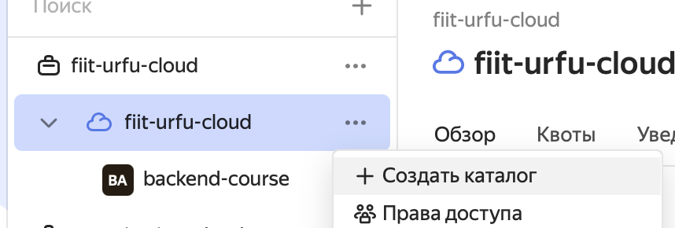
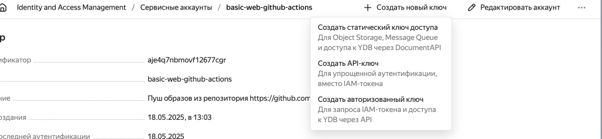
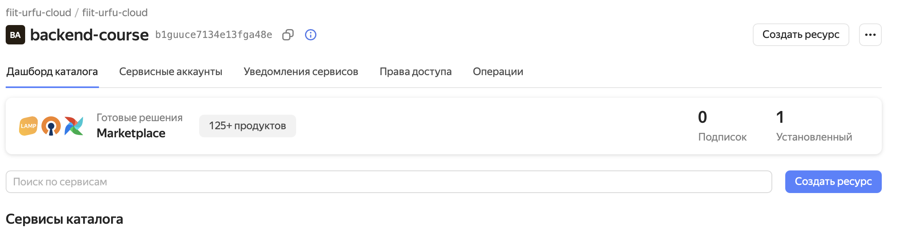
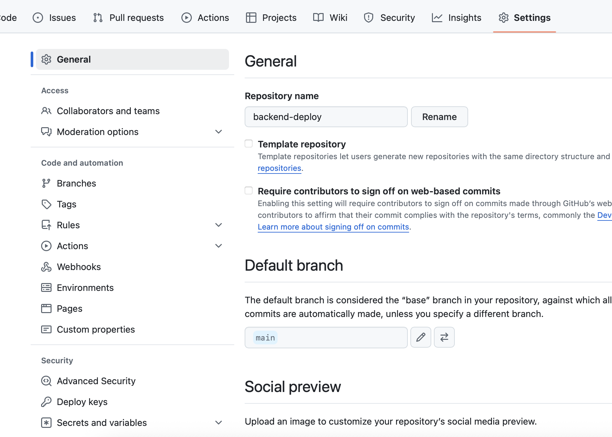
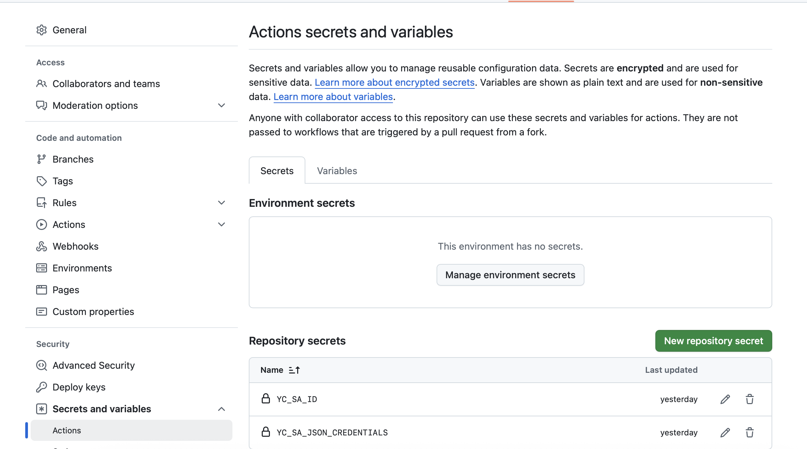
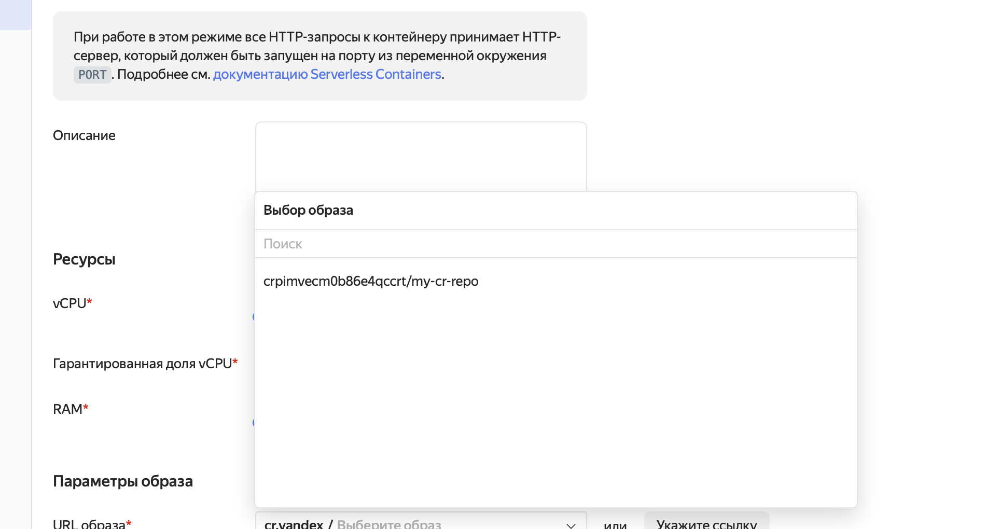

# 0. Подготовка к занятию

Установи себе Docker (можно с помощью Docker Desktop). Для Windows ещё понадобится настроить WSL.

# 1. Напиши Dockerfile

Основа сборки образа - Dockerfile. В нём описываются шаги по настройке того, что в итоге будет запщуено в Docker. Там можно описывать сборку приложения, установку вспомогательных программ и пакетов, запуск каких-либо команд. Подробнее можно изучить в [документации](https://docs.docker.com/reference/dockerfile/).

Мы же напишем небольшой Dockerfile, который будет подготавливать окружение для запуска приложения на Express.

Создай в корне репозитория файл под названием `Dockerfile` и вставь в него следующее содержимое:

```docker
FROM node:latest
COPY deploy-app /app
WORKDIR /app
RUN npm i

ENTRYPOINT [ "npm", "start" ]
```

Разберёмся, что здесь написано:

- `FROM` задаёт базовый образ для нашего образа. Базовых образов может быть несколько, следовательно, будет несколько инструкций `FROM`.
- `COPY` копирует файлы и директории с хоста в образ. Первый параметр - путь на хосте, он всегда относительный. Второй - путь в образе, может быть как относительным, так и абсолютным.
- `WORKDIR` задаёт рабочую директорию для выполнения следующих команд.
- `RUN` выполняет описанную далее команду (обычно в shell). В данном случае мы устанавливаем пакеты.
- `ENTRYPOINT` задаёт команду/приложение, которая будет выполнена/которое будет запущено при старте контейнера из нашего образа. В нашем случае мы запускаем приложение с помощью npm start.

# 2. Собери образ и запусти контейнер

Попробуем теперь собрать образ. В директории с Dockerfile напиши команду

```bash
docker build -t my-app .
```

`-t` - так называемый "тег" образа, метка, по которому образ проще будет идентифицировать. Без него будет образ будет идентифицироваться по SHA-хэшу. Обычно в тег пишут ещё и версию образа.
`.` - контекст для билда, в нашем случае он равен текущей директории.

После сборки образа скопируй название образа из вывода команды `docker build` и запусти контейнер с помощью

```bash
docker run название_образа
```

Должны появиться логи запуска Express-приложения.

# 3. Yandex Cloud

Поскольку нам доступен этот провайдер, научимся деплоить в него.
Для этого открой https://console.yandex.cloud/ и в облаке `fiit-urfu-cloud` (если оно доступно) создай каталог с любым названием:


После этого перейди в созданный каталог, потом во вкладку Сервисные аккаунт, перейди оттуда в `Identity and Access Management`. Создай там сервисный аккаунт. Можно сразу навесить на него роль `admin`.


Нажми на него, затем на "Создать новый ключ" -> "Создать авторизованный ключ".

Сохрани себе json-файл с ключами, он пригодится для настройки GitHub Actions.

Теперь перейди обратно в каталог ресурсов, нажми на "Создать ресурс".


Выбери `Реестр Docker-образов`, `Создать реестр`, назови как угодно. Галочки со сканирования можно снять, если не хочешь тратить дополнительные средства на них, но рекомендуется оставить, как есть.
Сохрани себе идентификатор реестра.

# 4. Настройка секретов в GitHub

В своём репозитории выбери вкладку `Settings` и найди пункт `Secrets and variables`:


Выбери `Actions` и нажми на `New repository secret`:


Назови секрет YC_SA_JSON_CREDENTIALS и вставь содержимое JSON-файла с ключами с прошлого шага.

# 5. Деплой через GitHub Actions

Все пайплайны в GitHub Actions должны лежать в папке `.github/workflows` в корне репозитория.

Создай эту директорию, создай в ней файл с произвольным именем и расширением `.yml`. Вставь в него следующее содержимое:

```yaml
on: push
permissions:
  contents: read
  pages: write
  id-token: write
jobs:
  yc_deploy_job:
    runs-on: ubuntu-latest
    name: A job to deploy to Yandex Cloud
    steps:
      - name: checkout
        uses: actions/checkout@v4

      - name: Login to Yandex Cloud Container Registry
        id: login-cr
        uses: yc-actions/yc-cr-login@v3
        with:
          yc-sa-json-credentials: ${{ secrets.YC_SA_JSON_CREDENTIALS }}

      - name: Build, tag, and push image to Yandex Cloud Container Registry
        env:
          CR_REGISTRY: aaaaaaaaa
          CR_REPOSITORY: my-cr-repo
          IMAGE_TAG: ${{ github.sha }}
        run: |
          docker build -t cr.yandex/$CR_REGISTRY/$CR_REPOSITORY:$IMAGE_TAG .
          docker push cr.yandex/$CR_REGISTRY/$CR_REPOSITORY:$IMAGE_TAG
```

Что здесь происходит:

- workflow будет запускаться на каждый пуш;
- задаются разрешения на некоторые действия, нас интересует `id-token` (чтобы можно было его использовать для обращения к Yandex Cloud);
- создаётся job с заданными именем и описанием и набором шагов:
  - склонировать репозиторий на сборочный агент;
  - аутентифицироваться в Yandex Cloud с помощью yc-sa-json-credentials (это тот самый JSON с ключами, который получили на третьем шаге);
  - собрать и запушить образ в заданный с помощью переменной CR_REGISTRY реестр Docker-образов.
    Обрати внимание: в CR_REGISTRY нужно записать идентификатор созданного на третьем шаге реестра.

Сделай commit и push в свой репозиторий. Проверь, что пайплайн прошёл успешно (вкладка Actions).

# 6. Создание serverless-контейнера в Yandex Cloud

Теперь создадим serverless-контейнер (чтобы не возиться самим с настройкой VM, Docker, DNS и прочего).
Перейди в консоль Yandex Cloud, выбери свой каталог и создай ресурс типа `Serverless контейнер`. Задай ему имя и описание.

Оставь параметры по умолчанию и выбери в параметрах образа сначала свой реестр, затем - запушенный образ.



Нажми на `Создать ревизию`. После этого дождись создания контейнера. Если в нём не окажется ревизий - нажми на `Создать ревизию` и выполни настройку ещё раз. После создания ревизии нажми на ссылку, которую даёт Yandex Cloud и проверь, что открывается приложение на Express.
